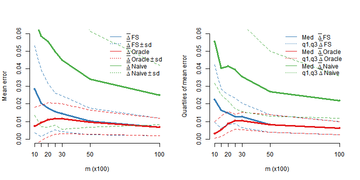

``` r
####################################################
### R code to reproduce the submitted manuscript
###
### "hdMTD:
###  An R Package for High-Dimensional Mixture Transition
###  Distribution Models"
###
### Authors: Maiara Gripp, Guilherme Ost, Giulio Iacobelli, Daniel Y. Takahashi
### Date: July 2025
####################################################

# Required packages:
# install.packages(c("hdMTD", "dplyr", "ggplot2", "lubridate", "purrr", "tidyr"))

## Load packages
library("hdMTD")
library("dplyr")
```

```
## Warning: pacote 'dplyr' foi compilado no R versão 4.4.3
```

```
## 
## Anexando pacote: 'dplyr'
```

```
## O seguinte objeto é mascarado por 'package:testthat':
## 
##     matches
```

```
## Os seguintes objetos são mascarados por 'package:stats':
## 
##     filter, lag
```

```
## Os seguintes objetos são mascarados por 'package:base':
## 
##     intersect, setdiff, setequal, union
```

``` r
library("ggplot2")
```

```
## Warning: pacote 'ggplot2' foi compilado no R versão 4.4.3
```

``` r
library("lubridate")
```

```
## Warning: pacote 'lubridate' foi compilado no R versão 4.4.3
```

```
## 
## Anexando pacote: 'lubridate'
```

```
## Os seguintes objetos são mascarados por 'package:base':
## 
##     date, intersect, setdiff, union
```

``` r
library("purrr")
```

```
## Warning: pacote 'purrr' foi compilado no R versão 4.4.3
```

```
## 
## Anexando pacote: 'purrr'
```

```
## O seguinte objeto é mascarado por 'package:testthat':
## 
##     is_null
```

``` r
library("tidyr")
```

```
## Warning: pacote 'tidyr' foi compilado no R versão 4.4.3
```

```
## 
## Anexando pacote: 'tidyr'
```

```
## O seguinte objeto é mascarado por 'package:testthat':
## 
##     matches
```

``` r
library("future")
```

```
## Warning: pacote 'future' foi compilado no R versão 4.4.3
```

``` r
library("future.apply")
```

```
## Warning: pacote 'future.apply' foi compilado no R versão 4.4.3
```

``` r
## Load precomputed outputs
precomputed <- readRDS(file = "hdMTD_outputs.rds")

# Set recompute_all = TRUE to override all precomputed results (not recommended)
recompute_all <- FALSE

# All procedures that take longer than ~2 minutes were precomputed and stored in
# hdMTD_outputs.rds, simulated_data.rds and results_sequential_selection.rds.
# To recompute any of them, set the corresponding `recompute <- TRUE` block to
# activate the code.
```

## Section 5: Using hdMTD
### 5.1 Data generation

1. Generate MTD model:

Parameters: $\Lambda = \{-30,-15,-1\}$, $\mathcal{A} = \{0,1\}$,
$\lambda_0= \{0.01\}$, $\lambda_{-1} = 0.39$, $\lambda_{-15} = \lambda_{-30} = 0.3$,
$p_0(0)=p_0(1)=0.5$, and transition matrices $p_j$, $j\in\Lambda$, sampled uniformly.


``` r
set.seed(11)
Lambda <- c(1, 15, 30)
A <- c(0, 1)
lam0 <- 0.01
lamj <- c(0.39, 0.3, 0.3)
p0 <- c(0.5, 0.5)
MTD <- MTDmodel(Lambda = Lambda, A = A, lam0 = lam0, lamj = lamj, p0 = p0)
summary(MTD)
```

```
## Mixture Transition Distribution (MTD) model 
## 
## Call:
## MTDmodel(Lambda = Lambda, A = A, lam0 = lam0, lamj = lamj, p0 = p0)
## 
## Relevant lags: -1, -15, -30
## State space: 0, 1
## 
## lambdas (weights):
##   lam0  lam-1 lam-15 lam-30 
##   0.01   0.39   0.30   0.30 
## 
## Independent distribution p0:
## p0(0) p0(1) 
##   0.5   0.5 
## 
## Transition matrices pj (one per lag):
##  
##  pj for lag j = -1:
##            0         1
## 0 0.35190318 0.6480968
## 1 0.03558321 0.9644168
##  
##  pj for lag j = -15:
##           0         1
## 0 0.4278830 0.5721170
## 1 0.7670555 0.2329445
##  
##  pj for lag j = -30:
##           0         1
## 0 0.8341439 0.1658561
## 1 0.2184814 0.7815186
## 
## Transition matrix P: 8 x 2
## - Preview of first rows of P:
##             0         1
## 000 0.5208503 0.4791497
## 001 0.3974855 0.6025145
## 010 0.6226020 0.3773980
## 011 0.4992372 0.5007628
## 100 0.3361516 0.6638484
## 101 0.2127868 0.7872132
## 
## Reading guide for P:
## Rows list past contexts from oldest to newest, matching lags (-30, -15, -1).
```


2. Sample from the invariant distribution


``` r
X <- perfectSample(MTD, N = 1000)
```


### 5.2 Estimation

3. Estimate relevant lags using FS method


``` r
hdMTD_FS(X, d = 40, l = 4)
```

```
## [1] 30 15  1 27
```


``` r
FS <- hdMTD(X, d = 40, method = "FS", l = 4)
S(FS); summary(FS)
```

```
## [1] 30 15  1 27
```

```
## hdMTD lag selection
## 
## Call:
## hdMTD(X = X, d = 40, method = "FS", l = 4)
## 
## Method: FS
## Order upper bound (d): 40
## Selected S set: 30, 15, 1, 27
## 
## Relevant lag set estimated by FS method : -30, -15, -1, -27
```


4. Estimate relevant lags using BIC method


``` r
recompute <-  FALSE
recompute <- ifelse(recompute_all, TRUE, recompute)
```


``` r
if (recompute) {
  hdMTD_BIC(X, d = 40, minl = 4, maxl = 4) #takes ~30min (on i7-1255U, 10 cores).
} else {
  precomputed$BIC_d40_l4
}
```

```
## [1]  1 15 17 30
```


Custom subset S


``` r
hdMTD_BIC(X, d = 40,
          S = c(1, 5, 10, 15, 17, 20, 27, 30, 35, 40),
          minl = 4, maxl = 4)
```

```
## [1]  1 15 17 30
```


Varying number of lags to be selected


``` r
hdMTD_BIC(X, d = 40,
          S = c(1, 5, 10, 15, 17, 20, 27, 30, 35, 40),
          minl = 1, maxl = 4)
```

```
## [1] 30
```


With BIC values by number of lags


``` r
hdMTD_BIC(X, d = 40,
          S = c(1, 5, 10, 15, 17, 20, 27, 30, 35, 40),
          minl = 1, maxl = 4,
          byl = TRUE, BICvalue = TRUE)
```

```
##           30        15,30      1,15,30   1,15,17,30 smallest: 30 
##     644.4959     648.0111     649.4950     650.2869     644.4959
```


Setting $\xi=0.4$


``` r
hdMTD_BIC(X, d = 40,
          S = c(1, 5, 10, 15, 17, 20, 27, 30, 35, 40),
          minl = 1, maxl = 4,
          byl = TRUE, BICvalue = TRUE,
          xi = 0.4)
```

```
##                   30                15,30              1,15,30           1,15,17,30 smallest: 1,15,17,30 
##             641.7328             643.1757             642.5873             641.3069             641.3069
```


All matrices $p_j$ are equal and $\lambda_0=0$


``` r
hdMTD_BIC(X, d = 40,
          S = c(1, 5, 10, 15, 17, 20, 27, 30, 35, 40),
          minl = 1, maxl = 4,
          byl = TRUE, BICvalue = TRUE,
          single_matrix = TRUE, indep_part = FALSE)
```

```
##                   30                15,30              1,15,30           1,15,17,30 smallest: 1,15,17,30 
##             637.5881             634.1956             628.7718             622.6559             622.6559
```


5. Estimate relevant lags using CUT method


``` r
recompute <-  TRUE
recompute <- ifelse(recompute_all, TRUE, recompute)
```


``` r
if (recompute) {
  hdMTD_CUT(X, d = 40, S = c(1, 5, 10, 15, 17, 20, 27, 30, 35, 40)) #takes ~2.5min.
} else {
  precomputed$CUT_d40
}
```

```
##  [1]  1  5 10 15 17 20 27 30 35 40
```


``` r
recompute <-  TRUE
recompute <- ifelse(recompute_all, TRUE, recompute)
```

Setting $\alpha = 0.13$


``` r
if (recompute) {
  hdMTD_CUT(X, d = 40, S = c(1, 5, 10, 15, 17, 20, 27, 30, 35, 40), alpha = 0.13) #takes ~2.5min.
} else {
  precomputed$CUT_d40_alpha
}
```

```
## [1]  1  5 27 35
```


Custom subset S


``` r
hdMTD_CUT(X, d = 40, S = c(1, 5, 17, 27, 30, 35), alpha = 0.13)
```

```
## [1]  1  5 17 30
```


6. Estimate relevant lags using FSC method


``` r
hdMTD_FSC(X, d = 40, l = 4, alpha = 0.1)
```

```
## [1] 24 30
```

Equivalent call: hdMTD(X, d = 40, method = "FSC", l = 4, alpha = 0.1)

FS method with halved sample


``` r
hdMTD_FS(X[1:500], d = 40, l = 4)
```

```
## [1] 11 30  7 24
```


7. Estimating transition probabilities


``` r
head(empirical_probs(X, S = c(1, 15, 30)), 6)
```

```
##   past_{ -30,-15,-1 } a p(a|past)
## 1                 000 0 0.5000000
## 2                 000 1 0.5000000
## 3                 001 0 0.3714286
## 4                 001 1 0.6285714
## 5                 010 0 0.6306306
## 6                 010 1 0.3693694
```


``` r
empirical_probs(X, S = c(1, 15, 30), matrixform = TRUE)
```

```
##             0         1
## 000 0.5000000 0.5000000
## 001 0.3714286 0.6285714
## 010 0.6306306 0.3693694
## 011 0.5065789 0.4934211
## 100 0.3861386 0.6138614
## 101 0.1987952 0.8012048
## 110 0.3888889 0.6111111
## 111 0.3697917 0.6302083
```


8. Oscillations

Computing from MTD


``` r
oscillation(MTD)
```

```
##        -1       -15       -30 
## 0.1233648 0.1017517 0.1846987
```

Estimating from sample


``` r
oscillation(X, S = c(1, 15, 30))
```

```
##        -1       -15       -30 
## 0.1076339 0.1166363 0.1675360
```


9. Estimating MTD parameters through the EM algorithm

Initial parameters for EM method


``` r
init <- list(
  'lambdas'= c(0.01, 0.33, 0.33, 0.33),
  'p0' = c(0.5, 0.5),
  'pj' = rep(list(matrix(c(0.5, 0.5, 0.5, 0.5), ncol = 2, nrow = 2)), 3)
)
```

Run EM


``` r
emMTD <- MTDest(X, S = c(1, 15, 30), init = init, iter = TRUE)
summary(emMTD)
```

```
## Summary of EM estimation for MTD model:
## 
## Call:
## MTDest(X = X, S = c(1, 15, 30), init = init, iter = TRUE)
## 
## Lags (-S): -1, -15, -30 
## State space (A): 0, 1 
## 
## lambdas (weights):
##        lam0       lam-1      lam-15      lam-30 
## 0.009353147 0.323151043 0.326490125 0.341005685 
## 
## Independent distribution p0:
##     p0(0)     p0(1) 
## 0.3911887 0.6088113 
## 
## Transition matrices pj (one per lag):
##  
##  pj for lag j = -1:
##           0         1
## 0 0.5982386 0.4017614
## 1 0.2641061 0.7358939
##  
##  pj for lag j = -15:
##           0         1
## 0 0.1909446 0.8090554
## 1 0.5495934 0.4504066
##  
##  pj for lag j = -30:
##           0         1
## 0 0.6978307 0.3021693
## 1 0.2113007 0.7886993
## 
## Log-likelihood: -623.879 
## 
## Iterations Report:
## Number of updates: 9 
## Last compared difference of logLik: 0.00700394
```

Stops after $9$ iterations


``` r
emMTD <- MTDest(X, S = c(1, 15, 30), M = NULL, nIter = 9, init = init, oscillations = TRUE)
summary(emMTD)
```

```
## Summary of EM estimation for MTD model:
## 
## Call:
## MTDest(X = X, S = c(1, 15, 30), M = NULL, init = init, nIter = 9, 
##     oscillations = TRUE)
## 
## Lags (-S): -1, -15, -30 
## State space (A): 0, 1 
## 
## lambdas (weights):
##        lam0       lam-1      lam-15      lam-30 
## 0.009353147 0.323151043 0.326490125 0.341005685 
## 
## Independent distribution p0:
##     p0(0)     p0(1) 
## 0.3911887 0.6088113 
## 
## Transition matrices pj (one per lag):
##  
##  pj for lag j = -1:
##           0         1
## 0 0.5982386 0.4017614
## 1 0.2641061 0.7358939
##  
##  pj for lag j = -15:
##           0         1
## 0 0.1909446 0.8090554
## 1 0.5495934 0.4504066
##  
##  pj for lag j = -30:
##           0         1
## 0 0.6978307 0.3021693
## 1 0.2113007 0.7886993
## 
## Log-likelihood: -623.879 
## 
## Oscillations:
##        -1       -15       -30 
## 0.1079753 0.1170953 0.1659095
```


Coercing an MTDest object to an MTD


``` r
emMTD <- MTDest(X, S = c(1, 15, 30), init = init)
MTD_hat <- as.MTD(emMTD)
```

Return estimated transition matrix


``` r
transitP(MTD_hat)
```

```
##             0         1
## 000 0.4972860 0.5027140
## 001 0.3893107 0.6106893
## 010 0.6143813 0.3856187
## 011 0.5064060 0.4935940
## 100 0.3313766 0.6686234
## 101 0.2234013 0.7765987
## 110 0.4484718 0.5515282
## 111 0.3404966 0.6595034
```


### 5.3 Testing hdMTD

1. MTD model specification:


``` r
set.seed(123)
Lambda <- c(1, 5)
A <- c(0, 1)
lam0 <- 0.01
p0 <- c(0.5, 0.5)
MTD <- MTDmodel(Lambda, A, lam0, p0 = p0) # Generates an MTD model
```


2. Simulation settings and results

Simulation parameters:


``` r
n <- 100      # Number of replications
N <- 10000    # Full sample size
m <- c(1000, 1500, 2000, 2500, 3000, 5000, 10000) # Subsample sizes
d <- 100      # Max order for FS and Oracle
dNaive <- 5   # Max order for Naive
pairList <- t(combn(d, 2)) # All possible pairs with digits from 1 to 100
npairs <- nrow(pairList)
minP11_P12 <- min(MTD$P[1, 1], MTD$P[1, 2])
```


``` r
recompute <-  FALSE
recompute <- ifelse(recompute_all, TRUE, recompute)

if (recompute) {

  FSP <- matrix(0, ncol = length(m), nrow = n)
  FS  <- matrix(0, ncol = length(m), nrow = n)
  NaiveP <- matrix(0, ncol = length(m), nrow = n)
  Naive  <- matrix(0, ncol = length(m), nrow = n)
  OracleP <- matrix(0, ncol = length(m), nrow = n)
  Oracle  <- matrix(0, ncol = length(m), nrow = n)
  SFS     <- matrix(0, ncol = length(m) * 2, nrow = n)
  ZOracle <- matrix(0, ncol = length(m) * 2, nrow = n)

  X_list <- vector("list", n)
  for (i in seq_len(n)) {
    X_list[[i]] <- perfectSample(MTD, N = N)
  }

  # 2) Paralel per replication
  workers <- max(1, parallel::detectCores() - 1)
  plan(multisession, workers = workers)
  on.exit(plan(sequential), add = TRUE)

  res_list <- future_lapply(seq_len(n), function(i) {
    X <- X_list[[i]]

    FS_i <- FSP_i <- Naive_i <- NaiveP_i <- Oracle_i <- OracleP_i <- numeric(length(m))
    SFS_row <- ZOracle_row <- integer(length(m) * 2)

    for (k in seq_along(m)) {
      Y <- X[seq_len(m[k])]
      ct <- countsTab(Y, d = d)

      # FS
      S <- hdMTD_FS(Y, d = d, l = 2)
      SFS_row[(k * 2 - 1):(k * 2)] <- S
      p_FS <- freqTab(S = S, A = A, countsTab = ct)$qax_Sj[1]
      err_FS <- abs(p_FS - MTD$P[1, 1])
      FS_i[k]  <- err_FS
      FSP_i[k] <- err_FS / minP11_P12

      # Naive
      ct_dNaive <- countsTab(Y, dNaive)
      p_Naive <- freqTab(S = seq_len(dNaive), A = A, countsTab = ct_dNaive)$qax_Sj[1]
      err_NV <- abs(p_Naive - MTD$P[1, 1])
      Naive_i[k]  <- err_NV
      NaiveP_i[k] <- err_NV / minP11_P12

      # Oracle
      p_pairs <- numeric(npairs)
      for (s in seq_len(npairs)) {
        p_pairs[s] <- freqTab(S = pairList[s, ], A = A, countsTab = ct)$qax_Sj[1]
      }
      minpos <- which.min(abs(p_pairs - MTD$P[1, 1]))
      ZOracle_row[(k * 2 - 1):(k * 2)] <- pairList[minpos, ]
      p_Oracle <- p_pairs[minpos]
      err_OR <- abs(p_Oracle - MTD$P[1, 1])
      Oracle_i[k]  <- err_OR
      OracleP_i[k] <- err_OR / minP11_P12
    }

    list(FS=FS_i, FSP=FSP_i, Naive=Naive_i, NaiveP=NaiveP_i,
         Oracle=Oracle_i, OracleP=OracleP_i,
         SFS=SFS_row, ZOracle=ZOracle_row)
  })

  FS      <- do.call(rbind, lapply(res_list, `[[`, "FS"))
  FSP     <- do.call(rbind, lapply(res_list, `[[`, "FSP"))
  Naive   <- do.call(rbind, lapply(res_list, `[[`, "Naive"))
  NaiveP  <- do.call(rbind, lapply(res_list, `[[`, "NaiveP"))
  Oracle  <- do.call(rbind, lapply(res_list, `[[`, "Oracle"))
  OracleP <- do.call(rbind, lapply(res_list, `[[`, "OracleP"))
  SFS     <- do.call(rbind, lapply(res_list, `[[`, "SFS"))
  ZOracle <- do.call(rbind, lapply(res_list, `[[`, "ZOracle"))

} else {
  #' Load precomputed results from `simulated_data.rds`
  simulated_data <- readRDS("simulated_data.rds")
  FS <- simulated_data$FS
  FSP <- simulated_data$FSP
  Oracle <- simulated_data$Oracle
  OracleP <- simulated_data$OracleP
  Naive <- simulated_data$Naive
  NaiveP <- simulated_data$NaiveP
  SFS <- simulated_data$SFS
  ZOracle <- simulated_data$ZOracle
}
```


3. Generate Table 1


``` r
means_table <- rbind(
  round(apply(FS, 2, mean), 5),
  round(apply(Oracle, 2, mean), 5),
  round(apply(Naive, 2, mean), 5),
  round(apply(FSP, 2, mean), 5),
  round(apply(OracleP, 2, mean), 5),
  round(apply(NaiveP, 2, mean), 5)
)
rownames(means_table) <- c(
  "Delta_FS(m)",
  "Delta_Oracle(m)",
  "Delta_Naive,5(m)",
  "std Delta_FS(m)",
  "std Delta_Oracle(m)",
  "std Delta_Naive,5(m)"
)
colnames(means_table) <- m
```


Table 1: Mean error of estimators

``` r
knitr::kable(means_table, caption = "Mean error of estimators", format = "markdown", booktabs = TRUE, escape = FALSE)
```


Table: Mean error of estimators

|                     |    1000|    1500|    2000|    2500|    3000|    5000|   10000|
|:--------------------|-------:|-------:|-------:|-------:|-------:|-------:|-------:|
|Delta_FS(m)          | 0.02847| 0.02026| 0.01752| 0.01561| 0.01442| 0.01010| 0.00681|
|Delta_Oracle(m)      | 0.00728| 0.00916| 0.01104| 0.01167| 0.01150| 0.00971| 0.00681|
|Delta_Naive,5(m)     | 0.06786| 0.05845| 0.05534| 0.04974| 0.04485| 0.03412| 0.02508|
|std Delta_FS(m)      | 0.06469| 0.04605| 0.03981| 0.03547| 0.03278| 0.02295| 0.01547|
|std Delta_Oracle(m)  | 0.01655| 0.02081| 0.02509| 0.02651| 0.02614| 0.02207| 0.01547|
|std Delta_Naive,5(m) | 0.15420| 0.13281| 0.12577| 0.11303| 0.10193| 0.07753| 0.05700|

4. Compute how often the FS output differs from Oracle by subsample size


``` r
m_index <- seq(1, length(m)*2, by = 2)
names(m_index) <- as.character(m)
SFS_vs_ZOracle_diff <- sapply(m_index, function(idx) {
  SFS_set <- apply(SFS[, c(idx, idx + 1)], 1, function(x) paste(sort(x), collapse = "-"))
  ZOracle_set <- apply(ZOracle[, c(idx, idx + 1)], 1, function(x) paste(sort(x), collapse = "-"))
  sum(SFS_set != ZOracle_set)
})
SFS_vs_ZOracle_diff
```

```
##  1000  1500  2000  2500  3000  5000 10000 
##    73    52    35    26    19     5     0
```


5. Generate Figure 1:

Data arrangement

FS


``` r
tab <- FS
FStab <- rbind(apply(tab, 2, summary),'sd'=apply(tab, 2, sd))
FStab <- rbind(FStab,'sdLo'=FStab[4,]-FStab[7,],'sdUp'=FStab[4,]+FStab[7,])
Fmean <- FStab[4,]
FsdUp <- FStab[9,]
FsdLo <- FStab[8,]
Fq1 <- FStab[2,]
Fq2 <- FStab[3,]
Fq3 <- FStab[5,]
```


NAIVE


``` r
tab <- Naive
Naivetab <- rbind(apply(tab, 2, summary),'sd'=apply(tab, 2, sd))
Naivetab <- rbind(Naivetab,'sdLo'=Naivetab[4,]-Naivetab[7,],'sdUp'=Naivetab[4,]+Naivetab[7,])
Nmean <- Naivetab[4,]
NsdUp <- Naivetab[9,]
NsdLo <- Naivetab[8,]
Nq1 <- Naivetab[2,]
Nq2 <- Naivetab[3,]
Nq3 <- Naivetab[5,]
```


ORACLE


``` r
tab <- Oracle
Oracletab <- rbind(apply(tab, 2, summary),'sd'=apply(tab, 2, sd))
Oracletab <- rbind(Oracletab,'sdLo'=Oracletab[4,]-Oracletab[7,],'sdUp'=Oracletab[4,]+Oracletab[7,])
Omean <- Oracletab[4,]
OsdUp <- Oracletab[9,]
OsdLo <- Oracletab[8,]
Oq1 <- Oracletab[2,]
Oq2 <- Oracletab[3,]
Oq3 <- Oracletab[5,]
```


### Plot Figure 1: Estimators mean error across $N_{rep}=100$ replications.

``` r
par(mfrow=c(1,2))

# --- Left panel: Mean error with standard deviation bands ---
 plot(m/100, Fmean, type = "l", col = "#377EB8",
      xlab = "m (x100)", ylab = "Mean error", ylim = c(0, 0.06),lwd=3,
      frame.plot = FALSE, xaxt="n", xlim = c(10,100))
 lines(m/100, Omean, type = "l", col = "#E41A1C",lwd=3)
 lines(m/100, Nmean, type = "l", col = "#4DAF4A",lwd=3)
 points(m/100, Fmean, col = "#377EB8", pch=19,cex=0.7)
 points(m/100, Omean, col = "#E41A1C", pch=19,cex=0.7)
 points(m/100, Nmean, col = "#4DAF4A", pch=19,cex=0.7)
 lines(m/100, FsdUp, type = "l", col = "#377EB8", lty = 2)
 lines(m/100, FsdLo, type = "l", col = "#377EB8", lty = 2)
 lines(m/100, OsdUp, type = "l", col = "#E41A1C", lty = 2)
 lines(m/100, OsdLo, type = "l", col = "#E41A1C", lty = 2)
 lines(m/100, NsdUp, type = "l", col = "#4DAF4A", lty = 2)
 lines(m/100, NsdLo, type = "l", col = "#4DAF4A", lty = 2)
 axis(side = 1, at = m/100, labels = m/100)
 legend("topright",
        legend = c(expression(bar(Delta) ~ "FS"),
                   expression(bar(Delta) ~ "FS" %+-% "sd"),
                   expression(bar(Delta) ~ "Oracle"),
                   expression(bar(Delta) ~ "Oracle" %+-% "sd"),
                   expression(bar(Delta) ~ "Naive"),
                   expression(bar(Delta) ~ "Naive" %+-% "sd")),
        col = c("#377EB8","#377EB8","#E41A1C","#E41A1C","#4DAF4A","#4DAF4A"), lty = c(1,3,1,3,1,3), bty = "n")
 # --- Right panel: Median and quartiles ---
 plot(m/100, Fq2, type = "l", col = "#377EB8",
      xlab = "m (x100)", ylab = "Quartiles of mean error", ylim = c(0, 0.06),lwd=3,
      frame.plot = FALSE, xaxt="n", xlim = c(10,100), lty=1)
 lines(m/100, Oq2, type = "l", col = "#E41A1C",lwd=3, lty=1)
 lines(m/100, Nq2, type = "l", col = "#4DAF4A",lwd=3, lty=1)
 points(m/100, Fq2, col = "#377EB8", pch=19,cex=0.7)
 points(m/100, Oq2, col = "#E41A1C", pch=19,cex=0.7)
 points(m/100, Nq2, col = "#4DAF4A", pch=19,cex=0.7)
 lines(m/100, Fq1, type = "l", col = "#377EB8", lty = 2)
 lines(m/100, Fq3, type = "l", col = "#377EB8", lty = 2)
 lines(m/100, Oq1, type = "l", col = "#E41A1C", lty = 2)
 lines(m/100, Oq3, type = "l", col = "#E41A1C", lty = 2)
 lines(m/100, Nq1, type = "l", col = "#4DAF4A", lty = 2)
 lines(m/100, Nq3, type = "l", col = "#4DAF4A", lty = 2)
 axis(side = 1, at = m/100, labels = m/100)
 legend("topright",
        legend = c(expression("Med  " ~ bar(Delta) ~ "FS"),
                   expression("q1,q3" ~ bar(Delta) ~ "FS"),
                   expression("Med  " ~ bar(Delta) ~ "Oracle"),
                   expression("q1,q3" ~ bar(Delta) ~ "Oracle"),
                   expression("Med  " ~ bar(Delta) ~ "Naive"),
                   expression("q1,q3" ~ bar(Delta) ~ "Naive")),
        col = c("#377EB8","#377EB8","#E41A1C","#E41A1C","#4DAF4A","#4DAF4A"), lty = c(1,3,1,3,1,3), bty = "n")
```



### 5.4 Analysis of Real-World Data


``` r
data("tempdata")
```


1. Treat NA data:

Removing days before "2010-08-05"


``` r
tempdata <- hdMTD::tempdata %>% filter(DATE >= "2010-08-05")
```

Identify remaining $155$ NA positions


``` r
posNA <- which(is.na(tempdata$MAXTEMP))
```

Fill short sequences of NAs ( $≤6$ NAs) using nearest neighbors mean


``` r
for (i in posNA) {
  if(!is.na(tempdata$MAXTEMP[i - 1]) && !all(is.na(tempdata$MAXTEMP[(i + 1):(i + 6)]))) {
    aux <- which(!is.na(tempdata$MAXTEMP[(i + 1):(i + 6)]))[1]
    tempdata$MAXTEMP[i] <- mean(tempdata$MAXTEMP[i - 1],tempdata$MAXTEMP[i + aux])
  }
}
```

Identify remaining $88$ NA positions


``` r
posNA <- which(is.na(tempdata$MAXTEMP))
```

Fill remaining NA with the mean of the previous hour temperature, next hour
temperature, and same hour of previous day temperature.


``` r
for (i in posNA) {
  tempdata$MAXTEMP[i] <- mean(c(tempdata$MAXTEMP[i - 1], tempdata$MAXTEMP[i + 1],
                                tempdata$MAXTEMP[i - 24]),na.rm = TRUE)
}
```


2. Compute mean daily maximum temperatures:


``` r
temp <- tempdata %>%
  group_by(DATE) %>%
  summarize(MAXTEMP = mean(MAXTEMP), .groups = 'drop')
head(temp, 4)
```

```
## # A tibble: 4 × 2
##   DATE       MAXTEMP
##   <date>       <dbl>
## 1 2010-08-05    20.7
## 2 2010-08-06    20.5
## 3 2010-08-07    21.8
## 4 2010-08-08    22.3
```


### Plot Figure 2: Time series with quarterly mean of daily maximum temperatures

``` r
TRIM_DATA <- temp %>%
  mutate(
    Y_TRIMESTER = paste0(year(DATE), "-T", quarter(DATE))
  ) %>%
  group_by(Y_TRIMESTER) %>%
  summarise(
    MEAN_TEMP = mean(MAXTEMP),
    DATA_REF = min(DATE)
  ) %>%
  ungroup() %>%
  arrange(DATA_REF)
TRIM_DATA <- TRIM_DATA[-c(1, nrow(TRIM_DATA)),]

ggplot(TRIM_DATA, aes(x = DATA_REF, y = MEAN_TEMP)) +
  geom_line(color = "steelblue", linewidth = 0.5) +
  geom_point(color = "steelblue", size = 1.2) +
  scale_x_date(
    date_breaks = "1 year",
    date_labels = "%Y",
    minor_breaks = NULL
  ) +
  theme_minimal() +
  theme(
    axis.text.x = element_text(angle = 45, hjust = 1, size = 12),
    axis.text.y = element_text(size = 12),
    panel.grid.major = element_line(color = "gray90"),
    axis.title.x = element_text(size = 15),
    axis.title.y = element_text(size = 15),
    plot.title = element_text(hjust = 0.5, size = 17, face = "bold")
  ) +
  labs(
    title = "Quarterly mean of daily maximum temperatures across the years",
    x = "Year",
    y = "Mean Temperature (°C)"
  )
```


3. Create categories of temperature:


``` r
xn <- max(temp$MAXTEMP)
x1 <- min(temp$MAXTEMP)
maxAmp <- xn - x1
temp$MAXTEMP1  <- ifelse(temp$MAXTEMP < x1 + maxAmp/2, 1, 2)
head(temp, 4)
```

```
## # A tibble: 4 × 3
##   DATE       MAXTEMP MAXTEMP1
##   <date>       <dbl>    <dbl>
## 1 2010-08-05    20.7        1
## 2 2010-08-06    20.5        1
## 3 2010-08-07    21.8        2
## 4 2010-08-08    22.3        2
```

``` r
prop.table(table(temp$MAXTEMP1)) # frequency of thermal regimes
```

```
## 
##         1         2 
## 0.2606497 0.7393503
```


4. Run FS for temp:


``` r
Temp12 <- rev(temp$MAXTEMP1)
```

hdMTD functions assume the sample is sorted from the latest observations to
oldest.


``` r
recompute <- TRUE
recompute <- ifelse(recompute_all, TRUE, recompute)
```


``` r
if (recompute) {
  hdMTD_FS(Temp12, d = 400, l = 3) #takes ~7min.
} else {
  precomputed$FS_Temp12_d400
}
```

```
## [1]   1 364   6
```


Note: The next code line is mentioned in the article but without a CodeChunk <br>
Reduce maximum order to improve estimation <br>


``` r
recompute <-  FALSE
recompute <- ifelse(recompute_all, TRUE, recompute)
```


``` r
if (recompute) {
  hdMTD_FS(Temp12, d = 364, l = 3) #takes ~6min.
} else {
  precomputed$FS_Temp12_d364
}
```

```
## [1]   1 364   6
```


5. Split sample in Train and Test data:


``` r
ndays <- nrow(temp %>%
                filter(DATE >= "2023-09-01")) # 366 days in the latest year of the sample
Temp12_Train <- Temp12[-seq_len(ndays)] # Training data with 4775 days
Temp12_Test <- Temp12[seq_len(ndays)] # Test data
```


6. Rerun FS for Train data:


``` r
recompute <-  TRUE
recompute <- ifelse(recompute_all, TRUE, recompute)
```


``` r
if (recompute) {
  hdMTD_FS(Temp12_Train, d = 364, l = 3) #takes ~5min.
} else {
  precomputed$FS_Temp12Train
}
```

```
## [1]   1 364   6
```

7. Trim out irrelevant lags:

With CUT method


``` r
hdMTD_CUT(Temp12_Train, d = 364, S = c(1, 364, 6))
```

```
## [1]   1   6 364
```

With BIC method


``` r
hdMTD_BIC(Temp12_Train, d = 364, S = c(1, 364, 6), minl = 1, maxl = 3,
          byl = TRUE, BICvalue = TRUE )
```

```
##                 1             1,364           1,6,364 smallest: 1,6,364 
##          1720.801          1690.543          1674.080          1674.080
```


8. Lag selection with FSC method:


``` r
recompute <-  TRUE
recompute <- ifelse(recompute_all, TRUE, recompute)
```


``` r
if (recompute) {
  hdMTD_FSC(Temp12_Train, d = 364, l = 3) #takes ~3min.
} else {
  precomputed$FSC_Temp12Train
}
```

```
## [1]   1   6 364
```


9. Estimated transition matrix for FS method output:


``` r
P_FS <- empirical_probs(Temp12_Train, S = c(1, 6, 364), matrixform = T)
P_FS
```

```
##              1         2
## 111 0.86626140 0.1337386
## 112 0.24736842 0.7526316
## 121 0.77157360 0.2284264
## 122 0.13318777 0.8668122
## 211 0.78846154 0.2115385
## 212 0.10972569 0.8902743
## 221 0.57506361 0.4249364
## 222 0.07283555 0.9271645
```


### Classic method for choosing relevant lag set:

10. Compute models:


``` r
ct <- countsTab(Temp12_Train, d = 6) # Table with size 6 sequence counts
head(ct,4)
```

```
## # A tibble: 4 × 8
##      x6    x5    x4    x3    x2    x1     a   Nxa
##   <dbl> <dbl> <dbl> <dbl> <dbl> <dbl> <dbl> <int>
## 1     1     1     1     1     1     1     1   342
## 2     1     1     1     1     1     1     2    62
## 3     1     1     1     1     1     2     1    18
## 4     1     1     1     1     1     2     2    62
```


MC1 (does not explicitly appear in the article)


``` r
ft <- freqTab(S = 1, A = c(1, 2), countsTab = ct)
LL <- sum(log(ft$qax_Sj) * ft$Nxa_Sj)
freeParam <- 2 * 1
BICMC1 <- -LL + 0.5 * log(length(Temp12_Train)) * freeParam
BICMC1
```

```
## [1] 1869.162
```

Comparable BIC if the model is a Markov chain of order $1$: $1869.162$

MC2 (does not explicitly appear in the article)


``` r
ft <- freqTab(S = c(1, 2), A = c(1, 2), countsTab = ct)
LL <- sum(log(ft$qax_Sj) * ft$Nxa_Sj)
freeParam <- 2^2 * 1
BICMC2 <- -LL + 0.5 * log(length(Temp12_Train)) * freeParam
BICMC2
```

```
## [1] 1850.598
```

Comparable BIC if the model is a Markov chain of order $2$: $1850.598$

MC3. Used as example in the article


``` r
ft <- freqTab(S = c(1, 2, 3), A = c(1, 2), countsTab = ct)
head(ft, 4)
```

```
## # A tibble: 4 × 7
##      x3    x2    x1     a Nxa_Sj Nx_Sj qax_Sj
##   <dbl> <dbl> <dbl> <dbl>  <int> <int>  <dbl>
## 1     1     1     1     1    587   726  0.809
## 2     1     1     1     2    139   726  0.191
## 3     1     1     2     1     38   206  0.184
## 4     1     1     2     2    168   206  0.816
```

``` r
LL <- sum(log(ft$qax_Sj) * ft$Nxa_Sj)
freeParam <- 2^3 * 1
BICMC3 <- -LL + 0.5 * log(length(Temp12_Train)) * freeParam
BICMC3
```

```
## [1] 1854.029
```

Comparable BIC if the model is a Markov chain of order $3$: $1854.029$

MC4 (does not explicitly appear in the article)


``` r
ft <- freqTab(S = c(1, 2, 3, 4), A = c(1, 2), countsTab = ct)
LL <- sum(log(ft$qax_Sj) * ft$Nxa_Sj)
freeParam <- 2^4 * 1
BICMC4 <- -LL + 0.5 * log(length(Temp12_Train)) * freeParam
BICMC4
```

```
## [1] 1877.888
```

Comparable BIC if the model is a Markov chain of order $4$: $1877.888$

MC5 (does not explicitly appear in the article)


``` r
ft <- freqTab(S = c(1, 2, 3, 4, 5), A = c(1, 2), countsTab = ct)
pos <- which(ft$Nxa_Sj > 0)
LL <- sum(log(ft$qax_Sj[pos]) * ft$Nxa_Sj[pos])
freeParam <- 2^5 * 1
BICMC5 <- -LL + 0.5 * log(length(Temp12_Train)) * freeParam
BICMC5
```

```
## [1] 1925.962
```

Comparable BIC if the model is a Markov chain of order $5$: $1925.962$

MC6 (does not explicitly appear in the article)


``` r
ft <- freqTab(S = c(1, 2, 3, 4, 5, 6), A = c(1, 2), countsTab = ct)
pos <- which(ft$Nxa_Sj > 0)
LL <- sum(log(ft$qax_Sj[pos]) * ft$Nxa_Sj[pos])
freeParam <- 2^6 * 1
BICMC6 <- -LL + 0.5 * log(length(Temp12_Train)) * freeParam
BICMC6
```

```
## [1] 2031.679
```

Comparable BIC if the model is a Markov chain of order $6$: $2031.679$

11. Comparing models:


``` r
BIC_vals <-  c(BICMC1, BICMC2, BICMC3, BICMC4, BICMC5, BICMC6)
model_names <- paste0("MC", 1:6)
minBIC_idx <- which.min(BIC_vals)
BIC_fmt <- sprintf("%.3f", BIC_vals)
BIC_fmt[minBIC_idx] <- paste0("**", BIC_fmt[minBIC_idx], "**")
minBIC_idx
```

```
## [1] 2
```

The classic method chooses order $2$ ($S=\{-2,-1\}$).

Table 2: BIC values


``` r
bic_matrix <- data.frame(matrix(BIC_fmt, nrow = 1))
colnames(bic_matrix) <- model_names
rownames(bic_matrix) <- "BIC"
```


``` r
knitr::kable(bic_matrix, caption = "BIC values computed for classical Markov chain models of different orders.")
```


Table: BIC values computed for classical Markov chain models of different orders.

|    |MC1      |MC2          |MC3      |MC4      |MC5      |MC6      |
|:---|:--------|:------------|:--------|:--------|:--------|:--------|
|BIC |1869.162 |**1850.598** |1854.029 |1877.888 |1925.962 |2031.679 |

Estimated matrix for $S=\{-2,-1\}$


``` r
P_MC2 <- empirical_probs(Temp12_Train, S = c(1, 2), matrixform = TRUE)
P_MC2
```

```
##             1         2
## 11 0.77813505 0.2218650
## 12 0.16326531 0.8367347
## 21 0.60233918 0.3976608
## 22 0.09064976 0.9093502
```

Independent model distribution:


``` r
P_Ind <- prop.table(table(Temp12_Train))
P_Ind
```

```
## Temp12_Train
##         1         2 
## 0.2672251 0.7327749
```


### Comparing methods

12. Computing values for Table 3.


``` r
Days1 <- which(Temp12_Test == 1)
lenDays1 <- length(Days1)
lenDays1 / ndays # frequency of low temperature days
```

```
## [1] 0.1748634
```

``` r
Temp12_Test <- c(Temp12_Test, Temp12_Train[seq_len(364)])
```


``` r
set.seed(1)
hitInd <- numeric(1000)
hitMC2 <- numeric(1000)
hitFS <- numeric(1000)
T1Ind <- numeric(1000)
T1MC2 <- numeric(1000)
T1FS <- numeric(1000)
F1Ind <- numeric(1000)
F1MC2 <- numeric(1000)
F1FS <- numeric(1000)
pasts2 <- rownames(P_MC2)
pastsFS <- rownames(P_FS)
```


``` r
for (j in seq_len(1000)){
  u <- runif(ndays)
  predInd <- numeric(ndays)
  predMC2 <- numeric(ndays)
  predFS <- numeric(ndays)

  for (i in ndays:1) {
    predInd[i] <- ifelse(u[i] <= P_Ind[1], 1, 2)
    pastRow <- which(pasts2 == paste0(rev(Temp12_Test[c(i+1, i+2)]), collapse = ""))
    predMC2[i] <- ifelse(u[i] <= P_MC2[pastRow, 1], 1, 2)
    pastRow <- which(pastsFS == paste0(rev(Temp12_Test[c(i+1, i+6, i+364)]), collapse = ""))
    predFS[i] <- ifelse(u[i] <= P_FS[pastRow, 1], 1, 2)
  }

  hitInd[j] <- sum(predInd == Temp12_Test[seq_len(ndays)])
  hitMC2[j] <- sum(predMC2 == Temp12_Test[seq_len(ndays)])
  hitFS[j] <- sum(predFS == Temp12_Test[seq_len(ndays)])
  T1Ind[j] <- sum(predInd[Days1] == 1)
  T1MC2[j] <- sum(predMC2[Days1] == 1)
  T1FS[j] <- sum(predFS[Days1] == 1)
  F1Ind[j] <- sum(predInd[-Days1] == 1)
  F1MC2[j] <- sum(predMC2[-Days1] == 1)
  F1FS[j] <- sum(predFS[-Days1] == 1)
}
```

### Accuracy


``` r
AccInd <- mean(hitInd)/ndays
AccMC2 <- mean(hitMC2)/ndays
AccFS <- mean(hitFS)/ndays
AccInd; AccMC2; AccFS
```

```
## [1] 0.6509262
```

```
## [1] 0.8236585
```

```
## [1] 0.8349153
```

### Precision


``` r
PrecInd <- mean(T1Ind/(T1Ind + F1Ind))
PrecMC2 <- mean(T1MC2/(T1MC2 + F1MC2))
PrecFS <- mean(T1FS/(T1FS + F1FS))
PrecInd; PrecMC2; PrecFS
```

```
## [1] 0.1745824
```

```
## [1] 0.4981026
```

```
## [1] 0.5249133
```

### Sensitivity (Recall)


``` r
SensInd <- mean(T1Ind)/lenDays1
SensMC2 <- mean(T1MC2)/lenDays1
SensFS <- mean(T1FS)/lenDays1
SensInd; SensMC2; SensFS
```

```
## [1] 0.2671875
```

```
## [1] 0.5870313
```

```
## [1] 0.6294531
```

### Specificity


``` r
SpecInd <- 1 - mean(F1Ind)/(ndays - lenDays1)
SpecMC2 <- 1 - mean(F1MC2)/(ndays - lenDays1)
SpecFS <- 1 - mean(F1FS)/(ndays - lenDays1)
SpecInd; SpecMC2; SpecFS
```

```
## [1] 0.7322483
```

```
## [1] 0.8738046
```

```
## [1] 0.878457
```

### F1-Score


``` r
F1ScoreInd <- 2 * (PrecInd * SensInd) / (PrecInd + SensInd)
F1ScoreMC2 <- 2 * (PrecMC2 * SensMC2) / (PrecMC2 + SensMC2)
F1ScoreFS <- 2 * (PrecFS * SensFS) / (PrecFS + SensFS)
F1ScoreInd; F1ScoreMC2; F1ScoreFS
```

```
## [1] 0.2111789
```

```
## [1] 0.538923
```

```
## [1] 0.5724496
```

Table 3: Model performance metrics


``` r
metric <- c("Accuracy", "Precision", "Sensitivity (Recall)", "Specificity", "F1-Score")
formula <- c("(TP+TN)/(TP+TN+FP+FN)",
             "TP/(TP+FP)",
             "TP/(TP+FN)",
             "TN/(TN+FP)",
             "2(PPV*Recall)/(PPV+Recall)")
performance_table <- data.frame(
  Metric = metric,
  Formula = formula,
  indc = round(c(AccInd, PrecInd, SensInd, SpecInd, F1ScoreInd) * 100, 2),
  mc2c = round(c(AccMC2, PrecMC2, SensMC2, SpecMC2, F1ScoreMC2) * 100, 2),
  fsc = round(c(AccFS, PrecFS, SensFS, SpecFS, F1ScoreFS) * 100, 2),
  check.names = FALSE
)
names(performance_table) <- c("Metric", "Formula", "Ind (\\%)", "MC2 (\\%)", "FS (\\%)")
```


``` r
knitr::kable(performance_table, align = "l", caption = "Model performance metrics.")
```


Table: Model performance metrics.

|Metric               |Formula                    |Ind (\%) |MC2 (\%) |FS (\%) |
|:--------------------|:--------------------------|:--------|:--------|:-------|
|Accuracy             |(TP+TN)/(TP+TN+FP+FN)      |65.09    |82.37    |83.49   |
|Precision            |TP/(TP+FP)                 |17.46    |49.81    |52.49   |
|Sensitivity (Recall) |TP/(TP+FN)                 |26.72    |58.70    |62.95   |
|Specificity          |TN/(TN+FP)                 |73.22    |87.38    |87.85   |
|F1-Score             |2(PPV*Recall)/(PPV+Recall) |21.12    |53.89    |57.24   |

### Plot Figure 3: Exploratory analysis of accuracies


``` r
accuracy_data <- data.frame(
  MC2 = hitMC2 / ndays,
  FS = hitFS / ndays
) %>%
  pivot_longer(
    everything(),
    names_to = "Model",
    values_to = "Accuracy"
  )

ggplot(accuracy_data, aes(x = Model, y = Accuracy, fill = Model)) +
  geom_boxplot() +
  labs(
    title = "Accuracy distribution (1000 replications)",
    x = "Model",
    y = "Accuracy"
  ) +
  theme_minimal() +
  scale_fill_brewer(palette = "Paired") +
  theme(
    plot.title = element_text(hjust = 0.5, size = 18, face = "bold"),
    axis.title = element_text(size = 16),
    axis.text = element_text(size = 14),
    legend.title = element_text(size = 16),
    legend.text = element_text(size = 14)
  )
```


### Empirical $\nu$ Analysis

13. FS sequential selection based on $\hat{\nu}_{n,j,S}$ values:


``` r
run_sequential_lag_selection <- function(Temp12_Train, d = 364) {
  # Initialization
  A <-  sort(unique(Temp12_Train))
  lenA <- length(A)
  lenX <- length(Temp12_Train)
  A_pairs <- matrix(A, ncol = 2) # All unique state pairs
  ct <- countsTab(X = Temp12_Train, d = 364) # Sequence counts table

  # Initialize storage
  results <- list(
    nuj1 = numeric(d),
    nuj2 = numeric(d-1),
    nuj3 = numeric(d-2),
    selected_lags = numeric(3)
  )

  # Helper function for empirical distribution calculation
  PI <- function(S, groupTab, x_S, lenX, d) {
    if (length(S) > 0) {
      filtr_S <- paste0("x", S)
      groupTab <- groupTab %>%
        dplyr::mutate(match = purrr::pmap_lgl(dplyr::pick(dplyr::all_of(filtr_S)),
                                              ~ all(c(...) == x_S))) %>%
        dplyr::filter(match) %>%
        dplyr::select(-match)
    }
    PI <- matrix(groupTab$Nx_Sj/(lenX - d),ncol = 1)
    PI
  }

  # Sequential Selection Process
  cat("=== Starting Sequential Lag Selection ===\n")

  # Step 1: Initial selection (S = ∅)
  cat("\n[Step 1] Selecting first lag (S = ∅)...\n")
  S <- NULL
  Sc <- sort(setdiff(seq_len(d), S), decreasing = TRUE) # Complement of S in 1:d

  for (z in seq_along(Sc)) { # Runs across all available lags
    j <- Sc[z]
    # Frequency tables
    b_Sja <- freqTab(S = S, j = j, A = A, countsTab = ct)
    b_Sj <- b_Sja %>%
      dplyr::group_by(dplyr::across(dplyr::all_of(paste0("x", j)))) %>%
      dplyr::summarise(Nx_Sj = sum(Nxa_Sj), .groups = "drop")

    # Compute νj
    PIs <- PI(S = S, groupTab = b_Sj, x_S = S, lenX = lenX, d = 364)
    dTVs <- dTV_sample(S = S, j = j, lenA = lenA, base = b_Sja,
                       A_pairs = A_pairs, x_S = S)
    results$nuj1[z] <- prod(PIs) * dTVs
  }
  results$selected_lags[1] <- Sc[which.max(results$nuj1)]
  cat(sprintf("Selected: j = %d (ν = %.4f)\n",
              results$selected_lags[1], max(results$nuj1)))

  # Step 2: Second selection (S = {1})
  cat(sprintf("\n[Step 2] Selecting second lag (S = {%d})...\n",
              results$selected_lags[1]))
  S <- results$selected_lags[1]
  Sc <- sort(setdiff(seq_len(d), S), decreasing = TRUE)

  for (z in seq_along(Sc)) {
    j <- Sc[z]
    Sj <- sort(c(S, j), decreasing = TRUE)

    # Frequency tables
    b_Sja <- freqTab(S = S, j = j, A = A, countsTab = ct)
    b_Sj <- b_Sja %>%
      dplyr::group_by(dplyr::across(dplyr::all_of(paste0("x", Sj)))) %>%
      dplyr::summarise(Nx_Sj = sum(Nxa_Sj), .groups = "drop")
    b_S <- b_Sja %>%
      dplyr::group_by(dplyr::across(dplyr::all_of(paste0("x", S)))) %>%
      dplyr::summarise(Nx_Sj = sum(Nxa_Sj), .groups = "drop")

    subx <- b_S[, -ncol(b_S)]

    # Compute ν_j
    for (t in which(b_S$Nx_Sj > 0)) {
      PIs <- PI(S = S, groupTab = b_Sj, x_S = subx[t, ],
                lenX = lenX, d = d)
      dTVs <- dTV_sample(S = S, j = j, lenA = lenA, base = b_Sja,
                         A_pairs = A_pairs, x_S = subx[t, ])
      PI_xS <- as.numeric(b_S[t, ncol(b_S)]/(lenX - d))
      results$nuj2[z] <- results$nuj2[z] + prod(PIs) * dTVs/PI_xS
    }
  }
  results$selected_lags[2] <- Sc[which.max(results$nuj2)]
  cat(sprintf("Selected: j = %d (ν = %.4f)\n",
              results$selected_lags[2], max(results$nuj2)))

  # Step 3: Third selection (S = {1,364})
  cat(sprintf("\n[Step 3] Selecting third lag (S = {%d,%d})...\n",
              results$selected_lags[1], results$selected_lags[2]))
  S <- c(S, results$selected_lags[2])
  Sc <- sort(setdiff(seq_len(d), S), decreasing = TRUE)

  for (z in seq_along(Sc)) {
    j <- Sc[z]
    Sj <- sort(c(S, j), decreasing = TRUE)
    dec_S <- rev(S) # S in decreasing order

    # Frequency tables
    b_Sja <- freqTab(S = dec_S, j = j, A = A, countsTab = ct)
    b_Sj <- b_Sja %>%
      dplyr::group_by(dplyr::across(dplyr::all_of(paste0("x", Sj)))) %>%
      dplyr::summarise(Nx_Sj = sum(Nxa_Sj), .groups = "drop")
    b_S <- b_Sja %>%
      dplyr::group_by(dplyr::across(dplyr::all_of(paste0("x", dec_S)))) %>%
      dplyr::summarise(Nx_Sj = sum(Nxa_Sj), .groups = "drop")

    subx <- b_S[, -ncol(b_S)]

    # Compute ν_j
    for (t in which(b_S$Nx_Sj > 0)) {
      PIs <- PI(S = dec_S, groupTab = b_Sj, x_S = subx[t, ],
                lenX = lenX, d = d)
      dTVs <- dTV_sample(S = dec_S, j = j, lenA = lenA, base = b_Sja,
                         A_pairs = A_pairs, x_S = subx[t, ])
      PI_xS <- as.numeric(b_S[t, ncol(b_S)]/(lenX - d))
      results$nuj3[z] <- results$nuj3[z] + prod(PIs) * dTVs/PI_xS
    }
  }
  results$selected_lags[3] <- Sc[which.max(results$nuj3)]
  cat(sprintf("Selected: j = %d (ν = %.4f)\n",
              results$selected_lags[3], max(results$nuj3)))

  # Final Results
  cat("\n=== Final Selection Results ===\n")
  print(data.frame(Step = 1:3, Selected_Lag = results$selected_lags,
                   nu = c(max(results$nuj1), max(results$nuj2), max(results$nuj3))))

  return(results)
}
```


``` r
recompute <-  TRUE
recompute <- ifelse(recompute_all, TRUE, recompute)
if (recompute) {
  results <- run_sequential_lag_selection(Temp12_Train) #takes ~6 min
} else {
  results <- readRDS("results_sequential_selection.rds") # using precomputed results
  cat("\n=== Final Selection Results ===\n")
  print(data.frame(Step = 1:3, Selected_Lag = results$selected_lags,
                   nu = c(max(results$nuj1), max(results$nuj2), max(results$nuj3))))
}
```

```
## === Starting Sequential Lag Selection ===
## 
## [Step 1] Selecting first lag (S = ∅)...
## Selected: j = 1 (ν = 0.1253)
## 
## [Step 2] Selecting second lag (S = {1})...
## Selected: j = 364 (ν = 0.0216)
## 
## [Step 3] Selecting third lag (S = {1,364})...
## Selected: j = 6 (ν = 0.0165)
## 
## === Final Selection Results ===
##   Step Selected_Lag         nu
## 1    1            1 0.12533879
## 2    2          364 0.02162680
## 3    3            6 0.01652459
```


### Plot Figure 4: FS sequential step analysis through $\hat{\nu}_{n,j,S}$.

``` r
par(mfrow = c(1, 3), mar = c(5, 6, 4, 2), oma = c(0, 0, 4, 0))
palette <- c("#E41A1C", "#377EB8", "#4DAF4A")
with(results, {
  # Graph 1
  Sc <-  364:1
  plot(1:364, rev(nuj1), type = "p", pch = 19, cex = 0.8, col = "gray70",
       ylab = "", xlab = "Lag (-j)", cex.lab = 1.8, cex.axis = 1.3,
       ylim = c(0,0.13), main = "", panel.first = grid())
  title(main = expression(paste("S = ", Ø)), cex.main = 1.5, font.main = 1)
  title(ylab = expression(widehat(nu)[n*","*j*","*S]), line = 4, cex.lab = 1.8)
  points(Sc[which.max(nuj1)], nuj1[which.max(nuj1)], pch = 21, bg = palette[1], cex = 1.5, lwd = 1)
  text(Sc[which.max(nuj1)], nuj1[which.max(nuj1)], labels = paste0(Sc[which.max(nuj1)]),
       pos = 3, col = palette[1], font = 2, cex = 1.4)
  # Graph 2
  Sc <- 364:2
  plot(2:364, rev(nuj2), type = "p", pch = 19, cex = 0.8, col = "gray70",
       ylab = "", xlab = "Lag (-j)", cex.lab = 1.8, cex.axis = 1.3,
       ylim = c(0,0.025),  main = "", panel.first = grid())
  title(main = "With S = {-1}", cex.main = 1.5, font.main = 1)
  title(ylab = expression(widehat(nu)[n*","*j*","*S]), line = 4, cex.lab = 1.8)
  points(Sc[which.max(nuj2)], nuj2[which.max(nuj2)], pch = 21, bg = palette[2], cex = 1.5, lwd = 1)
  text(Sc[which.max(nuj2)]-5, nuj2[which.max(nuj2)], labels = paste0(Sc[which.max(nuj2)]),
       pos = 3, col = palette[2], font = 2, cex = 1.4)
  # Graph 3
  Sc <- 363:2
  plot(2:363, rev(nuj3), type = "p", pch = 19, cex = 0.8, col = "gray70",
       ylab = "", xlab = "Lag (-j)", cex.lab = 1.8, cex.axis = 1.3,
       ylim = c(0,0.025), main = "", panel.first = grid())
  title(main = "With S = {-364, -1}", cex.main = 1.5, font.main = 1)
  title(ylab = expression(widehat(nu)[n*","*j*","*S]), line = 4, cex.lab = 1.8)
  points(Sc[which.max(nuj3)], nuj3[which.max(nuj3)], pch = 21, bg = palette[3], cex = 1.5, lwd = 1)
  text(Sc[which.max(nuj3)], nuj3[which.max(nuj3)], labels = paste0(Sc[which.max(nuj3)]),
       pos = 3, col = palette[3], font = 2, cex = 1.4)

  mtext(expression(paste("Sequential lag selection based on ", widehat(nu)[n*","*j*","*S])),
        outer = TRUE, cex = 1.6, font = 2, line = 1.4)
})
```


## Session info


``` r
sessionInfo()
```

```
## R version 4.4.1 (2024-06-14 ucrt)
## Platform: x86_64-w64-mingw32/x64
## Running under: Windows 11 x64 (build 26100)
## 
## Matrix products: default
## 
## 
## locale:
## [1] LC_COLLATE=Portuguese_Brazil.utf8  LC_CTYPE=Portuguese_Brazil.utf8    LC_MONETARY=Portuguese_Brazil.utf8
## [4] LC_NUMERIC=C                       LC_TIME=Portuguese_Brazil.utf8    
## 
## time zone: America/Sao_Paulo
## tzcode source: internal
## 
## attached base packages:
## [1] stats     graphics  grDevices utils     datasets  methods   base     
## 
## other attached packages:
##  [1] future.apply_1.20.0 future_1.67.0       tidyr_1.3.1         purrr_1.1.0         lubridate_1.9.4     ggplot2_3.5.2      
##  [7] dplyr_1.1.4         hdMTD_0.1.2         testthat_3.2.1.1    devtools_2.4.5      usethis_2.2.3      
## 
## loaded via a namespace (and not attached):
##  [1] tidyselect_1.2.1   farver_2.1.2       fastmap_1.2.0      xopen_1.0.1        promises_1.3.0     digest_0.6.36     
##  [7] timechange_0.3.0   mime_0.12          lifecycle_1.0.4    waldo_0.5.2        ellipsis_0.3.2     processx_3.8.4    
## [13] magrittr_2.0.3     compiler_4.4.1     rlang_1.1.6        tools_4.4.1        knitr_1.48         labeling_0.4.3    
## [19] prettyunits_1.2.0  htmlwidgets_1.6.4  pkgbuild_1.4.4     curl_5.2.1         RColorBrewer_1.1-3 xml2_1.3.6        
## [25] pkgload_1.4.0      miniUI_0.1.1.1     withr_3.0.2        desc_1.4.3         grid_4.4.1         fansi_1.0.6       
## [31] roxygen2_7.3.2     diffobj_0.3.5      urlchecker_1.0.1   profvis_0.3.8      xtable_1.8-4       colorspace_2.1-1  
## [37] globals_0.18.0     scales_1.3.0       cli_3.6.5          crayon_1.5.3       generics_0.1.4     remotes_2.5.0     
## [43] rstudioapi_0.16.0  commonmark_2.0.0   sessioninfo_1.2.2  cachem_1.1.0       stringr_1.5.1      parallel_4.4.1    
## [49] vctrs_0.6.5        callr_3.7.6        rcmdcheck_1.4.0    listenv_0.9.1      glue_1.8.0         parallelly_1.45.1 
## [55] rematch2_2.1.2     codetools_0.2-20   ps_1.7.7           stringi_1.8.4      gtable_0.3.5       later_1.3.2       
## [61] munsell_0.5.1      tibble_3.3.0       pillar_1.11.0      htmltools_0.5.8.1  brio_1.1.5         R6_2.6.1          
## [67] rprojroot_2.0.4    shiny_1.8.1.1      evaluate_0.24.0    highr_0.11         memoise_2.0.1      httpuv_1.6.15     
## [73] Rcpp_1.0.13-1      xfun_0.52          fs_1.6.4           pkgconfig_2.0.3
```

